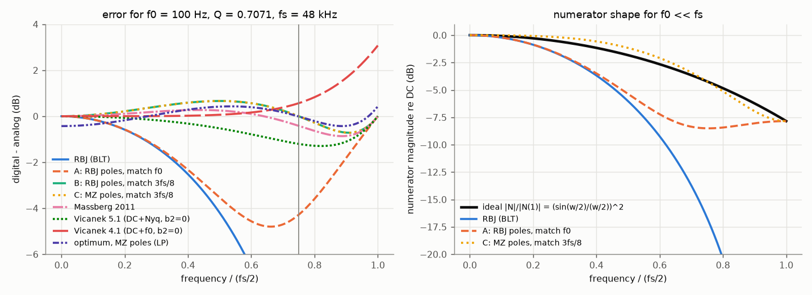
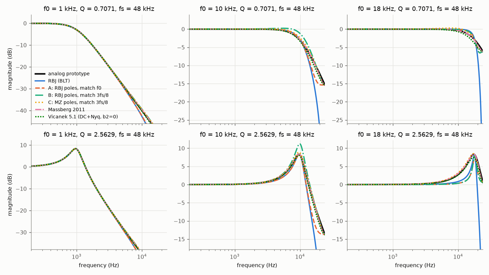
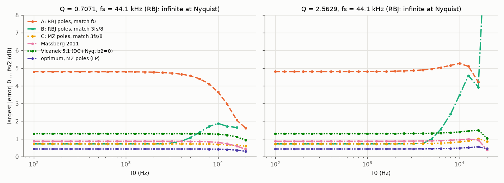
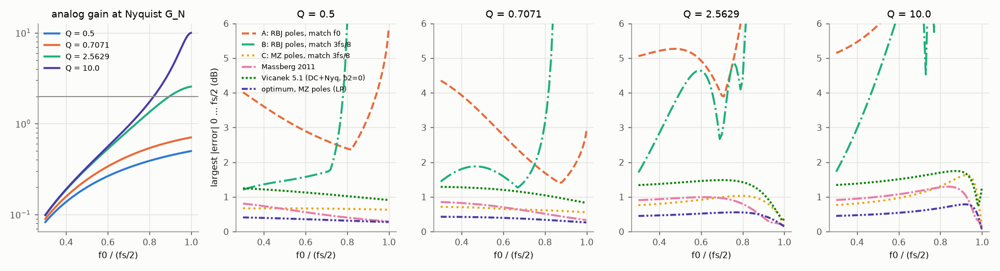
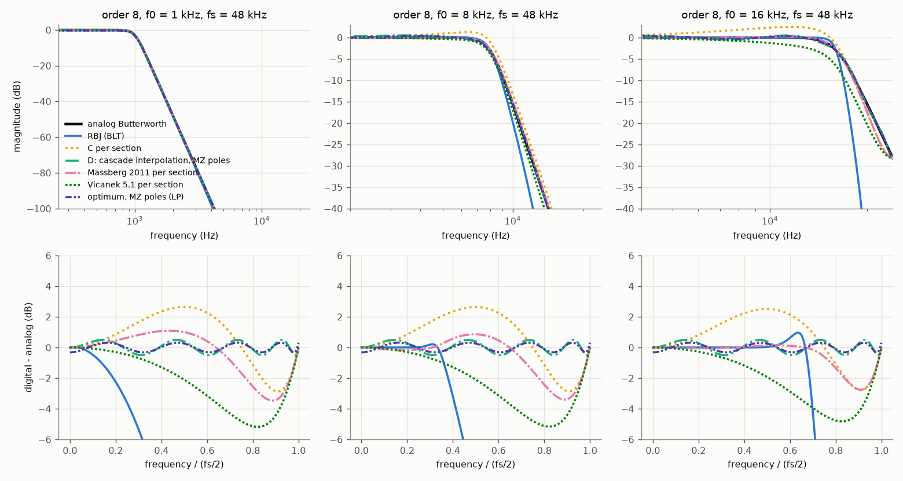
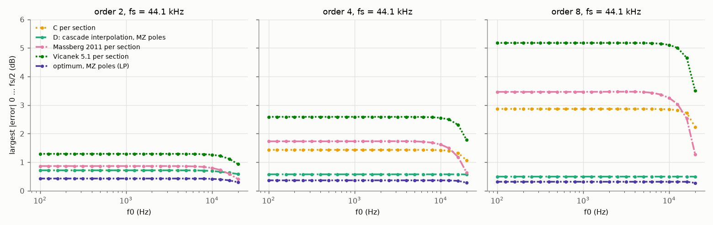

# Side study: a Nyquist-matched low-pass (zeros placed in the style of Orfanidis)

Status: study, 2026-10-09. No change to the pluginlab code.
Code: `~/AudioDev/measurement_tool/studies/decramped_lowpass/` (see its README; six scripts, about 6 minutes on 16 cores).
All numbers below come from the tables in its `out/` folder.

## 1. Question

Joerg Bitzer: "Orfanidis uses the analog gain at Nyquist to design a better peak filter. The same idea should work for
the low-pass filter (Butterworth design) for the zeros. [...] Can we derive a numerical approximation (just a
correction of the zero placement), or even derive a formula for a modified Butterworth design in the style of
Orfanidis, and finally in the design style of the RBJ cookbook?"

The BLT (RBJ cookbook, pluginlab `designRbj` / `designButterworth`) puts both zeros of a second-order low-pass at
z = -1. The digital gain at Nyquist is therefore 0 (minus infinity dB), while the analog prototype
H_a(s) = w0² / (s² + s w0/Q + w0²), evaluated at the real Nyquist frequency, has the finite gain

    G_N = |H_a(j 2 pi fs/2)| = r² / sqrt((1 - r²)² + r²/Q²),   r = 2 f0/fs.

Near Nyquist the BLT low-pass falls far too fast ("cramping"). Below 20 kHz the RBJ low-pass deviates from the analog
prototype by up to 27 dB (second order) and 108 dB (Butterworth order 8) on the grid of this study.

## 2. Short answer

1. **The literal Orfanidis analogue works algebraically but not in practice.** Keeping the RBJ poles and placing the
   zeros so that |H| equals the analog magnitude at DC, at f0 and at Nyquist has a neat closed form (design A,
   section 4). It removes the infinite error at Nyquist, but the error elsewhere becomes 4.8 dB for every f0 (0.7 dB
   would be possible). The reason is general (section 5): matching at f0 fixes the curvature of the numerator to the
   one the BLT needs near f0, and that is the wrong curvature for the rest of the band.
2. **The right third point is fixed, not f0.** For f0 << fs the ideal numerator shape is the same for every f0 and Q:
   |N(e^jw)| / |N(1)| = (sin(w/2) / (w/2))². The best two-zero numerator with exact DC and Nyquist gain matches the
   analog magnitude at w = 0.757 pi, i.e. at about 3 fs/8. Matching there (design B with RBJ poles, design C with
   impulse-invariant poles) gives 0.72 dB.
3. **With RBJ poles, moving the zeros is not enough for f0 above about fs/12.** The warping of the BLT also sits in
   the poles (narrowed, shifted resonance). Even the best possible numerator with RBJ poles (linear programme) leaves
   up to 7 dB (44.1 kHz, Q 10). With impulse-invariant (matched-z) poles, as Vicanek (2016) proposes, the zeros can
   do the rest.
4. **Recommended second-order section: design C** (impulse-invariant poles; |H| exact at DC, 3 fs/8 and Nyquist).
   Closed form in section 7. Whole band 0 ... fs/2 on 864 grid points: max 1.61 dB, median 0.72 dB (RBJ: infinite;
   0 ... 20 kHz: 27 dB). Numerical optimum with the same poles: 1.21 dB with exact DC and Nyquist, 0.78 dB with free
   gain. Always stable, minimum phase and realisable (24400 cases up to f0 = 0.999 fs/2, Q 0.3 ... 30).
5. **Butterworth cascades: match the cascade, not the sections.** Per-section matching (design C in every section)
   adds the section errors coherently: 1.43 dB (order 4), 2.87 dB (order 8). One numerator of degree N matched to the
   cascade at DC, at N-1 fixed frequencies and at Nyquist (design D_N, section 10) gives 0.58 dB (order 4) and 0.50 dB
   (order 8) for every f0 and fs, which equals the numerical optimum with exact DC and Nyquist gain. Its -3 dB point
   moves by up to 25 cents (order 8) to 122 cents (order 2); an exact corner costs almost nothing numerically for
   orders 4 and 8, but I found no simple closed rule for it.
6. **Prior work.** Vicanek (2016) has the framework (impulse-invariant poles, magnitude matching with B0, B1, B2) and
   two low-pass versions with one zero (b2 = 0): DC + f0 (3.1 dB on this grid) and DC + Nyquist (1.3 dB). Design C is
   a small extension of his framework (third match point at 3 fs/8, b2 free); I did not find it published, but I cannot
   rule that out. Massberg (2011) does an Orfanidis-style modified prototype for the low-pass section (0.87 dB, max
   1.29 dB). The cascade design D_N and the universal node sets are, as far as I know, new. Details in section 12.

## 3. Notation and the general (Orfanidis-style) form

H(z) = (b0 + b1 z^-1 + b2 z^-2) / (a0 + a1 z^-1 + a2 z^-2), w = 2 pi f / fs. Vicanek's magnitude form (2016, eq. 25-27):

    |H(e^jw)|² = (B0 phi0 + B1 phi1 + B2 phi2) / (A0 phi0 + A1 phi1 + A2 phi2),
    phi0 = cos²(w/2), phi1 = sin²(w/2), phi2 = 4 phi0 phi1,
    B0 = (b0 + b1 + b2)², B1 = (b0 - b1 + b2)², B2 = -4 b0 b2   (A0, A1, A2 likewise from a0, a1, a2).

B0 and B1 are the squared gains at DC and Nyquist (times the denominator values), B2 is the one remaining degree of
freedom. For **given poles** and the three prescribed gains G0 (DC), G1 (Nyquist) and G_M (at a frequency w_M):

    R0 = G0 (a0 + a1 + a2),  R1 = G1 (a0 - a1 + a2)
    B2 = (G_M² |A(e^{j w_M})|² - R0² phi0(w_M) - R1² phi1(w_M)) / phi2(w_M)
    W  = (R0 + R1)/2,  b0 = (W + sqrt(W² + B2))/2,  b1 = (R0 - R1)/2,  b2 = -B2 / (4 b0)

The last line is Vicanek's eq. 29; it gives the minimum-phase numerator (b0 > |b2|, b0 + b2 > |b1|) and requires
W² + B2 >= 0. This is the "Orfanidis style": the filter follows from gains at DC, Nyquist and one more frequency. All
designs below are special cases; they differ in the poles and in the choice of w_M.

## 4. Design A: RBJ poles, matched at DC, f0 and Nyquist (the literal analogue)

With the RBJ denominator (a0, a1, a2) = (1 + alpha, -2 cos w0, 1 - alpha), alpha = sin w0 / (2Q), the gain at f0 is
|H_a(f0)| = Q, and |A(e^{jw0})| = 2 alpha sin w0. The general form simplifies to (c = cos w0, s = sin w0):

    G_N  = r² / sqrt((1 - r²)² + r²/Q²),  r = 2 f0/fs
    beta = sqrt(G_N (2 - G_N))
    b0 = ((1 - c) + G_N (1 + c) + beta s) / 2
    b1 =  (1 - c) - G_N (1 + c)
    b2 = ((1 - c) + G_N (1 + c) - beta s) / 2
    a0 = 1 + alpha,  a1 = -2 c,  a2 = 1 - alpha

For G_N = 0 it is exactly the RBJ LPF. The discriminant is W² - 4 b0 b2 = sin²(w0) G_N (2 - G_N). In the s-domain
(Orfanidis' view) design A is the BLT, pre-warped at f0, of the **modified prototype**

    H'(s) = (G_N s² + sqrt(G_N (2 - G_N)) s + 1) / (s² + s/Q + 1)

i.e. the zeros move from infinity to Omega_z = 1/sqrt(G_N) with Q_z = 1/sqrt(2 - G_N). Because the zeros of H' lie in
the left half plane, design A is minimum phase. It is realisable only for G_N <= 2 (G_N > 2 occurs for Q > 2 and f0
near Nyquist: Q 2.56 above 0.91 fs/2, Q 10 above 0.83 fs/2). All identities were verified numerically on 20000 random
cases (`verify_algebra.py`, deviations at rounding level; sympy is not installed, so there is no symbolic proof).

**Result:** whole-band error 4.80 dB for every f0 up to fs/8, up to 30 dB near Nyquist at high Q (tables in
section 9). Figure: the dashed orange curves in the figures below.

## 5. Why matching at f0 fails: the universal numerator shape

For f0 << fs both the RBJ and the impulse-invariant denominators approach a double pole at z = 1, so
|A(e^jw)|² ~ (2 sin(w/2))⁴ for f >> f0, while |H_a|² ~ (w0/w)⁴. The numerator must therefore follow

    |N(e^jw)|² / |N(1)|²  ->  (sin(w/2) / (w/2))⁴   (independent of f0 and Q)

(the squared zero-order-hold response). Its value at Nyquist is (2/pi)⁴, consistent with G_N -> r². A two-zero
numerator has three parameters; DC and Nyquist fix two. The third decides the curvature:

- The RBJ pair (RBJ poles, RBJ zeros) is exact at f0 because the warping of poles and zeros cancels near f0. Matching
  |H(f0)| therefore forces the RBJ curvature cos⁴(w/2) near DC instead of the sinc⁴ curvature, and the numerator
  cannot reach the right shape at higher frequencies (figure, right).
- The minimax numerator with exact DC and Nyquist gain (1-D search) has an error of 0.70 dB, and its error curve
  crosses zero at w = 0.7576 pi for every f0 << fs (`find_nodes.py`). Matching at this point reproduces the optimum.
  The round value 3 fs/8 (w = 3 pi/4, cos = -1/sqrt 2) costs 0.013 dB (0.717 against 0.704 dB).

## 6. Design B: RBJ poles, matched at DC, 3 fs/8 and Nyquist (RBJ cookbook style)

    G_N  = |H_a(fs/2)| (as above),  G_M² = 1 / ((1 - v²)² + v²/Q²),  v = 3/(4 r) = (3 fs/8) / f0
    R0 = 2 (1 - c),  R1 = 2 (1 + c) G_N
    B2 = 2 G_M² (2 (1 + sqrt2 c)² + 2 alpha²) - (1 - 1/sqrt2) R0² - (1 + 1/sqrt2) R1²
    W  = (R0 + R1)/2,  b0 = (W + sqrt(W² + B2))/2,  b1 = (R0 - R1)/2,  b2 = -B2 / (4 b0)
    a0 = 1 + alpha,  a1 = -2 c,  a2 = 1 - alpha

(|A(e^{j 3pi/4})|² = 2 (1 + sqrt2 c)² + 2 alpha² for the RBJ denominator.) This is the best answer to the question as
asked (keep the BLT, change only the zeros): 0.72 dB for f0 up to fs/32, 1.07 dB up to fs/8. Above fs/8 it degrades
(3.8 dB up to fs/4, 18 dB above), and it is not realisable at 8 of 864 grid points. The limit is not the formula:
the best possible numerator for RBJ poles (linear programme, free gain) still has 1.5 dB up to fs/4 and 7.0 dB above.
**With RBJ poles, a zero correction cannot remove the cramping of the resonance.**

## 7. Design C (recommended section): impulse-invariant poles, matched at DC, 3 fs/8 and Nyquist

Ready to implement (double precision; normalised a0 = 1):

    w0 = 2 pi f0 / fs,  zeta = 1 / (2 Q),  r = 2 f0 / fs
    if zeta <= 1:  a1 = -2 exp(-zeta w0) cos(w0 sqrt(1 - zeta²))
    else:          a1 = -2 exp(-zeta w0) cosh(w0 sqrt(zeta² - 1))
    a2 = exp(-2 zeta w0)

    G_N² = r⁴ / ((1 - r²)² + r²/Q²)                    analog gain² at fs/2
    v    = 3 / (4 r)                                    (3 fs/8) / f0
    G_M² = 1 / ((1 - v²)² + v²/Q²)                      analog gain² at 3 fs/8

    R0 = 1 + a1 + a2
    R1 = G_N (1 - a1 + a2)
    B2 = 2 G_M² ((1 - a1/sqrt2)² + (a2 - a1/sqrt2)²) - (1 - 1/sqrt2) R0² - (1 + 1/sqrt2) R1²
    W  = (R0 + R1) / 2
    b0 = (W + sqrt(W² + B2)) / 2
    b1 = (R0 - R1) / 2
    b2 = -B2 / (4 b0)

The poles are Vicanek's eq. 12. Properties (grid of section 9 and `stability_sweep.py`):

- |H| is exact at DC (1), at 3 fs/8 and at Nyquist (G_N); verified to 1e-14.
- Always realisable (W² + B2 > 0), minimum phase (largest zero radius 0.953 over 24400 cases, f0/(fs/2) = 0.0005 ...
  0.999, Q 0.3 ... 30) and stable (poles exp(s_k T) are inside the unit circle for any Q > 0).
- The gain at f0 is not exact: up to 0.27 dB for f0 <= fs/8, up to 1.24 dB near Nyquist at Q 10 (20 kHz at 44.1 kHz).
- Numerics: R0 = 1 + a1 + a2 is of order w0² (1e-8 at 20 Hz, 48 kHz); the formula has no subtraction of nearly equal
  large terms in b0 and b1, but b2 = -B2/(4 b0) contains one (B2 is a difference). I compared the closed form with the
  general form down to 20 Hz (relative 2e-14) in double precision; single precision was not tested.

## 8. Numerical cross-check

For fixed poles, two numerical optima were computed for every grid point:

- **1-D:** |H| exact at DC and Nyquist, B2 chosen to minimise the largest dB error on 0 ... fs/2 (scan plus bounded
  Brent search).
- **LP:** the global minimax over all numerators of degree 2 with free gain. |N|² is a polynomial in
  x = sin²(w/2); the condition T <= |N|² <= K T (T = |H_a|² |A|²) is linear, so min K is a linear programme
  (HiGHS); the minimum-phase numerator follows from the roots in x (z + 1/z = 2 - 4 x). The LP error equals the
  re-evaluated error of the factorised filter (`verify_algebra.py`).

The ordering LP <= 1-D <= C holds everywhere, as it must. Design C is close to its 1-D optimum: 0.72 against 0.70 dB
for f0 <= fs/8, 1.61 against 1.21 dB in the worst case. Freeing the DC gain (LP) brings 0.43 dB, but then |H(0)| is
off by up to 0.43 dB, which is not acceptable for a low-pass reference.

## 9. Second-order sections on the grid

Grid: f0 = 24 ISO third-octave centres 100 Hz ... 20 kHz, Q = 0.5, 0.5098, 0.5412, 0.6013, 0.7071, 0.9, 1, 1.3066, 2,
2.5629, 5, 10 (includes the Butterworth Q values of orders 2, 4, 8), fs = 44.1, 48, 96 kHz: 864 points. Error = largest
|dB(H_digital) - dB(H_analog)| on 2000 frequencies (log and linear grid), whole band 0 ... fs/2 inclusive, and
0 ... 20 kHz. "MZ" = impulse-invariant (matched-z) poles.

| design | not realisable | whole band max | whole band median | <= 20 kHz max | max error at f0 | max zero radius |
|---|---|---|---|---|---|---|
| RBJ (BLT) | 0 | inf | inf | 27.14 | 0.00 | 1 (at z = -1) |
| A: RBJ poles, DC + f0 + Nyquist | 4 | 30.05 | 4.80 | 30.05 | 0.00 | 0.977 |
| B: RBJ poles, DC + 3fs/8 + Nyquist | 8 | 18.11 | 0.72 | 18.11 | 18.11 | 0.939 |
| **C: MZ poles, DC + 3fs/8 + Nyquist** | **0** | **1.61** | **0.72** | **1.24** | 1.24 | 0.804 |
| MZ poles, DC + f0 + Nyquist | 0 | 2.52 | 1.10 | 2.52 | 0.00 | 0.839 |
| RBJ poles, DC + Nyquist, b2 = 0 | 0 | 18.11 | 1.29 | 18.11 | 18.11 | 0.981 |
| Vicanek 4.1 (MZ, DC + f0, b2 = 0) | 0 | 3.40 | 3.07 | 1.74 | 0.00 | 0.722 |
| Vicanek 5.1 (MZ, DC + Nyquist, b2 = 0) | 0 | 1.73 | 1.29 | 1.62 | 1.44 | 0.798 |
| Massberg 2011 (via Vicanek) | 0 | 1.29 | 0.87 | 1.17 | 0.41 | 0.826 |
| optimum, RBJ poles, DC + Nyquist exact (1-D) | 0 | 11.36 | 0.71 | 11.36 | 11.36 | 0.899 |
| optimum, MZ poles, DC + Nyquist exact (1-D) | 0 | 1.21 | 0.70 | 1.21 | 0.84 | 0.830 |
| optimum, RBJ poles, free gain (LP) | 0 | 6.98 | 0.43 | 6.98 | 6.98 | 0.870 |
| optimum, MZ poles, free gain (LP) | 0 | 0.78 | 0.43 | 0.78 | 0.53 | 0.807 |

Whole-band max error (dB) by f0/fs (all Q and fs pooled):

| design | f0/fs <= 1/32 | 1/32 ... 1/16 | 1/16 ... 1/8 | 1/8 ... 1/4 | 1/4 ... 1/2 |
|---|---|---|---|---|---|
| A: RBJ poles, DC + f0 + Nyquist | 4.81 | 4.85 | 4.99 | 5.70 | 30.05 |
| B: RBJ poles, DC + 3fs/8 + Nyquist | 0.72 | 0.76 | 1.07 | 3.76 | 18.11 |
| **C: MZ poles, DC + 3fs/8 + Nyquist** | **0.72** | **0.72** | **0.74** | **0.84** | **1.61** |
| Vicanek 5.1 | 1.30 | 1.30 | 1.32 | 1.41 | 1.73 |
| Massberg 2011 | 0.87 | 0.87 | 0.89 | 0.97 | 1.29 |
| optimum, MZ poles, DC + Nyquist exact | 0.71 | 0.71 | 0.72 | 0.79 | 1.21 |
| optimum, RBJ poles, free gain (LP) | 0.43 | 0.44 | 0.51 | 1.54 | 6.98 |
| optimum, MZ poles, free gain (LP) | 0.43 | 0.43 | 0.44 | 0.49 | 0.78 |

By sample rate (whole band / 0 ... 20 kHz, dB): RBJ inf / 27.1 (44.1 kHz), inf / 18.2 (48 kHz), inf / 2.8 (96 kHz);
design C 1.61 / 1.24, 1.40 / 0.67, 0.82 / 0.62; Massberg 1.20 / 1.17, 1.29 / 0.80, 0.96 / 0.33. All designs depend
only on f0/fs and Q, so the sample rate only decides how close 20 kHz is to Nyquist. By Q, design C rises from
0.72 dB (Q <= 0.7) to 1.28 dB (Q 5) and 1.61 dB (Q 10); Massberg from 0.87 to 1.29 dB.

Examples, Q 0.7071 (whole band / <= 20 kHz, dB):

| design | 1 kHz @ 48 | 10 kHz @ 48 | 16 kHz @ 48 | 20 kHz @ 48 | 16 kHz @ 44.1 | 20 kHz @ 44.1 |
|---|---|---|---|---|---|---|
| RBJ | inf / 18.15 | inf / 15.15 | inf / 8.14 | inf / 1.51 | inf / 14.47 | inf / 1.96 |
| A | 4.79 / 4.79 | 3.85 / 3.85 | 2.38 / 2.38 | 1.55 / 1.17 | 2.06 / 2.06 | 1.60 / 1.60 |
| B | 0.72 / 0.67 | 1.84 / 1.84 | 1.28 / 1.28 | 5.40 / 3.03 | 1.64 / 1.64 | not realisable |
| C | 0.72 / 0.66 | 0.70 / 0.66 | 0.64 / 0.64 | 0.61 / 0.61 | 0.63 / 0.63 | 0.59 / 0.59 |
| Massberg | 0.87 / 0.76 | 0.82 / 0.70 | 0.64 / 0.50 | 0.48 / 0.34 | 0.59 / 0.59 | 0.41 / 0.41 |

**f0 towards Nyquist** (sweep f0/(fs/2) = 0.3 ... 0.999). G_N grows with f0 and Q (Q 10: 3.9 at 0.9 fs/2, 9.7 at
0.99 fs/2). Design A becomes unrealisable for G_N > 2; design B degrades to 41 to 49 dB at high Q. Design C stays at
or below 1.63 dB (largest at Q 10, f0 = 0.85 ... 0.95 fs/2) and becomes better again very close to Nyquist
(0.14 dB at 0.999 fs/2, Q 10). Massberg behaves the same way (max 1.29 dB).

**Phase** (not a design target). Every design whose zeros leave z = -1 has a real, positive H(-1) (minimum phase with
b0 > 0), so its phase at Nyquist is 0, while the analog phase there is close to -180 degrees. Up to about fs/3 the
phase difference is mostly a constant time advance: the fitted delay is -0.78 samples (median) for design C,
-0.76 for Massberg, -0.71 for Vicanek 5.1, -0.80 for the LP optimum; after removing it the residual is at most 20
degrees up to 0.9 fs/2 for design C (Massberg 24, Vicanek 5.1 34). RBJ has a fitted delay of 0.005 samples and a
residual of 14 degrees for f0 <= fs/8. **The magnitude match costs phase fidelity**: the digital filter behaves like
the analog one shifted by about 0.8 samples earlier. Raw phase deviations up to fs/4 are about 70 degrees for all
matched designs against 8 degrees for RBJ (f0 <= fs/8).

**Stability.** The largest pole radius on the grid is 0.9997 for all designs (Q 10 at 100 Hz). Design C and D_N
were realisable and minimum phase everywhere (section 7, `out/stability.txt`).

## 10. Butterworth cascades (orders 2, 4, 8)

Per-section matching (each section with its own G_N,k) automatically matches the whole cascade at DC, 3 fs/8 and
Nyquist, since the analog Butterworth is the product of the sections. But all sections approximate the same universal
shape (section 5) with the same sign of error, so their errors add: 0.72 / 1.43 / 2.87 dB for orders 2 / 4 / 8.
Distributing the Nyquist gain equally over the sections (G_N,total^(1/M) each) is worse at high f0 (11 dB, order 8).
Optimising the M per-section values B2_k jointly (Nelder-Mead) only reaches 1.10 dB (order 4) and 2.20 dB (order 8).

**Design D_N (cascade interpolation).** Keep the impulse-invariant poles of all sections and design **one** numerator
of degree N for the cascade: |N(e^jw)|² is a polynomial of degree N in x = sin²(w/2) (Bernstein basis). Prescribe the
analog cascade magnitude at DC, at Nyquist and at N-1 fixed interior frequencies (the nodes); this is a linear
(N+1) x (N+1) system. Factorise the polynomial (roots rho in x, z + 1/z = 2 - 4 rho, keep |z| < 1) and split the N
zeros into second-order sections. The nodes are the zero crossings of the error of the minimax numerator with exact DC
and Nyquist gain for f0 << fs (the same for every f0 and for 100 / 400 Hz; `find_nodes.py`), in fractions of fs/2:

| order | nodes / (fs/2) | minimax error (f0 << fs) |
|---|---|---|
| 2 | 0.75 (exact optimum 0.7576) | 0.70 dB |
| 4 | 0.4498, 0.7072, 0.9053 | 0.58 dB |
| 8 | 0.2339, 0.3890, 0.5421, 0.6706, 0.7914, 0.8848, 0.9604 | 0.50 dB |

D_2 is design C (checked). Results on the grid (24 f0 x 3 fs per order):

| design | order 2: whole band max | order 4 | order 8 | -3 dB point max abs, order 2 / 4 / 8 (cents) |
|---|---|---|---|---|
| RBJ (pluginlab `designButterworth`) | inf (<= 20 kHz: 26.9) | inf (53.9) | inf (107.7) | 0 / 0 / 0 |
| A per section | 4.80 | 9.60 | 19.20 | 0 / 0 / 383 |
| C per section | 0.72 | 1.43 | 2.87 | 122 / 115 / 112 |
| C, equal Nyquist split | 0.72 | 2.27 | 11.25 | 122 / 99 / 2171 |
| C, B2_k optimised jointly | 0.70 | 1.10 | 2.20 | 127 / 92 / 87 |
| **D_N, MZ poles** | **0.72** | **0.58** | **0.50** | **122 / 55 / 25** |
| D_N, RBJ poles | 5.40 | 1.47 | 1.38 | 302 / 127 / 55 |
| Massberg per section | 0.87 | 1.74 | 3.47 | 75 / 48 / 53 |
| Vicanek 5.1 per section | 1.29 | 2.59 | 5.18 | 218 / 244 / 425 |
| optimum, MZ poles, DC + Nyquist exact (LP) | 0.70 | 0.58 | 0.50 | 127 / 55 / 25 |
| optimum, MZ poles, DC + f0 + Nyquist exact (LP) | 2.40 | 0.62 | 0.51 | 0 / 0 / 0 |
| optimum, MZ poles, free gain (LP) | 0.43 | 0.37 | 0.32 | 90 / 38 / 16 |

D_N with MZ poles has the same error for every f0 and fs (order 8: 0.50 dB from 100 Hz to 20 kHz) and is equal to
its numerical optimum (DC and Nyquist exact) within 0.01 dB for orders 4 and 8 (order 2: 0.72 against 0.70 dB). It was realisable for all 400 sweep points up to f0 = 0.999 fs/2 (largest zero
radius 0.88).

**The -3 dB point.** None of the matched designs keeps the corner exactly. The deviation grows with f0/fs because the
error curve is small near DC: for D_8 it is 8 cents for f0 <= fs/32 and up to 25 cents above; for C per section (and D_2)
4 cents for f0 <= fs/32, 54 cents up to fs/8, 122 cents above. Massberg keeps the corner better at low f0 (2 cents up
to fs/8), because his design matches the analog peak region. A numerical design with DC, f0 and Nyquist all exact costs
almost nothing for orders 4 and 8 (0.62 and 0.51 dB) but much for order 2 (2.40 dB; there the solution is unique and
equals "MZ poles, DC + f0 + Nyquist"). Replacing the D_N node closest to f0 with f0 is a poor closed-form substitute
(1.3 to 1.5 dB).

**Slope near Nyquist** (fs = 48 kHz; dB per octave from fs/4 to fs/2 / over the last third octave):

| order 8 | f0 = 1 kHz | 10 kHz | 16 kHz | 20 kHz |
|---|---|---|---|---|
| analog | -48.2 / -48.2 | -47.9 / -48.2 | -28.1 / -47.4 | -12.9 / -33.8 |
| RBJ | -inf (zeros at Nyquist) | -inf | -inf | -inf |
| C per section | -50.8 / -45.2 | -50.6 / -45.2 | -30.6 / -44.6 | -15.2 / -31.3 |
| D_8, MZ poles | -48.6 / -48.1 | -48.3 / -48.1 | -28.5 / -47.3 | -13.3 / -33.7 |
| Massberg per section | -49.2 / -40.8 | -48.5 / -41.7 | -28.3 / -43.7 | -13.1 / -32.3 |

(Orders 2 and 4 in `out/tables_butterworth.md`; order 4 D_4: -23.8 / -25.7 against -24.1 / -24.1 at 1 kHz.)
**Phase:** the fitted time advance adds up over the sections (about 0.78 samples per section: -1.5 samples for order 4,
-3.0 for order 8).

## 11. High-pass and band-pass (short)

- **High-pass:** the RBJ HPF already has the right double zero at z = 1, and |H(-1)| = 1 equals the analog gain at
  s = infinity; for f0 <= fs/8 its error is 0.76 dB at most. With RBJ poles and a double zero at DC the numerator has
  no free parameter left, so a Nyquist correction of the zeros is not possible; the error at high f0 and Q (up to
  27 dB) sits in the warped poles. Vicanek's high-pass designs with impulse-invariant poles reduce it to 7.0 dB
  (matched at f0) or 11.1 dB (matched at Nyquist); up to fs/8 they give 0.3 dB. Little to gain at low f0; at high f0 the
  problem is not the zeros.
- **Band-pass (0 dB peak):** the RBJ BPF has zeros at DC and at Nyquist, so its Nyquist error is infinite, like the
  low-pass. Vicanek 4.3 (f0 matched) gives 3.05 dB, Vicanek 5.3 (Nyquist matched) 2.75 dB over the grid (2.2 / 1.0 dB
  for f0 <= fs/8). A three-point version in the style of design C (zero at DC, match at f0 for the peak, Nyquist, one
  more point) was not tried.

Numbers: `out/tables_hp_bp.md` (Q 0.5, 0.7071, 2, 10; same f0 and fs; errors from 10 Hz).

## 12. Prior work and how this study relates to it

- **R. Bristow-Johnson, "Cookbook formulae for audio EQ biquad filter coefficients"**: BLT pre-warped at f0; the
  baseline (pluginlab's `designRbj`, `designButterworth`).
- **S. J. Orfanidis, "Digital parametric equalizer design with prescribed Nyquist-frequency gain", JAES 45(6),
  444-455, 1997**: modifies the analog peak prototype so that after the BLT the digital gain at Nyquist equals the
  analog one. Design A is the same idea for the low-pass with the poles kept; its modified prototype
  (G_N s² + sqrt(G_N (2 - G_N)) s + 1) / (s² + s/Q + 1) is the low-pass counterpart. For the low-pass this idea alone
  is not enough (sections 4 and 5).
- **S. J. Orfanidis, "High-order digital parametric equalizer design", JAES 53(11), 1026-1046, 2005**: high-order
  Butterworth / Chebyshev / elliptic EQs via the BLT. I did not read the paper; according to its abstract and secondary
  sources it is BLT-based and does not prescribe the Nyquist gain. It does not address the question here.
- **M. Massberg, "Digital low-pass filter design with analog-matched magnitude response", AES 131st Convention, 2011,
  paper 8551**: pre-warped first- and second-order low-pass prototypes that match the analog magnitude after the BLT,
  in the Orfanidis spirit (poles and zeros of the prototype are modified; DC, Nyquist and the peak region are matched).
  I had only Vicanek's transcription (his eq. 20-23, where the alpha/beta labels of eq. 23 are swapped) and implemented
  that; it meets DC and Nyquist exactly. On this grid: 0.87 dB at low f0, 1.29 dB max; best corner accuracy of the
  matched designs. This is the closest published answer to the author's question for the second-order section.
- **M. Vicanek, "Matched Second Order Digital Filters", 14 Feb 2016** (vicanek.de/articles/BiquadFits.pdf):
  impulse-invariant poles and closed-form numerators from magnitude conditions in the B0/B1/B2 form; low-pass with
  one zero (b2 = 0) matched at DC and f0 (his 4.1; 3.07 dB here, the Nyquist error remains) or at DC and Nyquist (his
  5.1; 1.29 dB). He states that the third point is not imposed for the low-pass. **Design C is his framework with the
  third degree of freedom used: b2 free, matched at 3 fs/8.** This halves the error of his 5.1 at low f0 (0.72 against
  1.29 dB) and is better than Massberg (0.87 dB) at low f0; Massberg is better near Nyquist (0.3 against 0.6 dB) and at
  the corner. I did not find design C published; given how close it is to Vicanek's paper, I would call it an obvious
  extension, not a new method. Vicanek also has notes on matched shelving filters (ShelvingFits.pdf,
  2poleShelvingFits.pdf), not studied here.
- **New here, as far as I can tell:** the explanation of why the f0 match fails (universal numerator shape
  (sin(w/2)/(w/2))^N and the curvature argument), the fixed optimal node 0.7576 pi for the section, and design D_N
  (one degree-N numerator for a cascade, interpolated at fixed universal nodes), which reaches the numerical optimum
  for Butterworth orders 4 and 8. The literature search was short (two web searches and Vicanek's paper); I did not
  read Massberg's or Orfanidis' 2005 papers.

## 13. Recommendation

1. **As a reference design in the Reference EQ: yes, as an additional algorithm, not as a replacement.** pluginlab's
   `designButterworth` is defined by the BLT (`ReferenceTests`: |H|² = 1/(1 + W^2N) at the pre-warped frequency,
   -3.01 dB at the corner). A Nyquist-matched variant has a different contract: "close to the analog Butterworth on
   the whole band, within 0.5 to 0.72 dB; corner within 25 to 122 cents; time advance about 0.8 samples per section".
   It needs its own tests (like the Orfanidis peak: "closer to the analog curve than RBJ").
2. **Second order: design C** (section 7). Closed form, about 20 operations plus exp, cos/cosh and two square roots,
   always realisable and stable. If an exact corner matters more than the whole-band error, use Massberg instead
   (closed form, 0.87 dB, corner within 2 cents up to fs/8).
3. **Orders 4 and 8: design D_N** with the node table of section 10. It is not a closed form: it needs an
   (N+1) x (N+1) linear solve and the roots of a polynomial of degree N (companion matrix or Aberth iteration), once per
   design, which is fine for a reference design. Name suggestion: "Butterworth (analog-matched)" rather than
   "Nyquist-matched", since the match covers the whole band. If the corner must be exact, the LP variant
   (DC + f0 + Nyquist exact, 0.51 dB for order 8) is better, but it needs an LP solver at design time.
4. **Do not use design A** (RBJ poles matched at f0) or design B for f0 above fs/12: keeping the BLT poles is the
   limiting factor.
5. Odd orders (first-order section) and the Linkwitz-Riley cascades were not studied; D_N extends to them in
   principle (nodes for odd N would have to be computed; a Linkwitz-Riley of order 2N is the square of a Butterworth
   D_N, and its sum property with the high-pass would have to be checked).

## 14. Limits and what was not checked

- No symbolic proof: sympy is not installed; all identities were checked numerically (20000 random cases, rounding
  level).
- The error measure is the largest dB deviation on 0 ... fs/2 including Nyquist, unweighted. A perceptual weighting or
  an L2 measure would choose other nodes.
- The analog reference is evaluated at the real frequency (no pre-warping), as in the question.
- Massberg's design is taken from Vicanek's transcription, not from the original paper; differences to the original
  are possible. Orfanidis 2005 was not read.
- The nodes of D_N were derived for f0 << fs; at high f0 they are no longer optimal, but the result stayed within
  0.01 dB of the optimum on the grid. Nodes for odd orders were not computed.
- The cascade numerator is split into sections by pairing zeros by angle; the pairing of zero pairs with pole pairs
  (which matters for internal levels and noise in fixed point) was not studied.
- Single-precision behaviour and coefficient sensitivity (R0 ~ w0² at low f0) were not studied; Vicanek notes that
  his matched designs need double precision.
- Time-varying use (modulation, coefficient interpolation) was not studied.
- High-pass and band-pass were only compared with existing designs (section 11); no new design for them.
- No pluginlab code was changed; the formulas are not implemented or tested in C++.

Sources: [Vicanek 2016](https://www.vicanek.de/articles/BiquadFits.pdf),
[Massberg 2011, AES e-library](https://aes2.org/publications/elibrary-page/?id=16077),
[Orfanidis 2005, AES e-library](https://aes2.org/publications/elibrary-page/?id=13397),
Orfanidis 1997 and the RBJ cookbook as cited by Vicanek.
