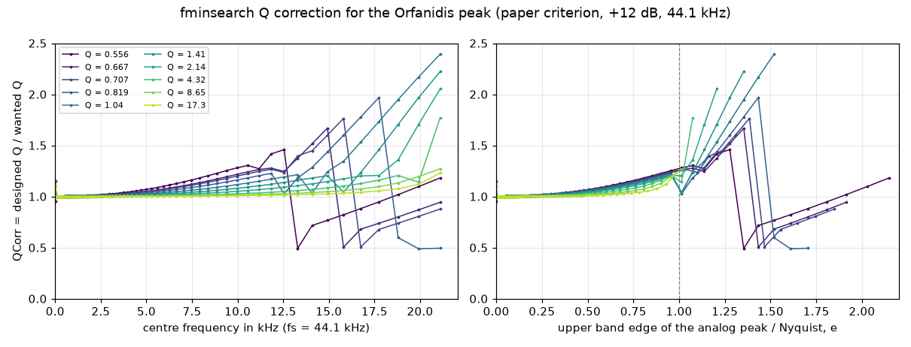
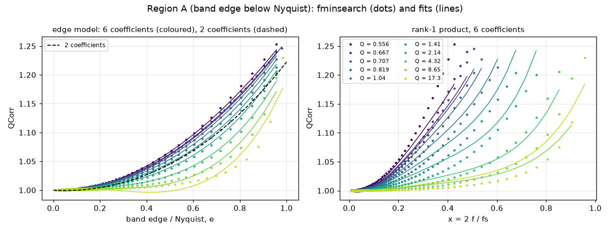
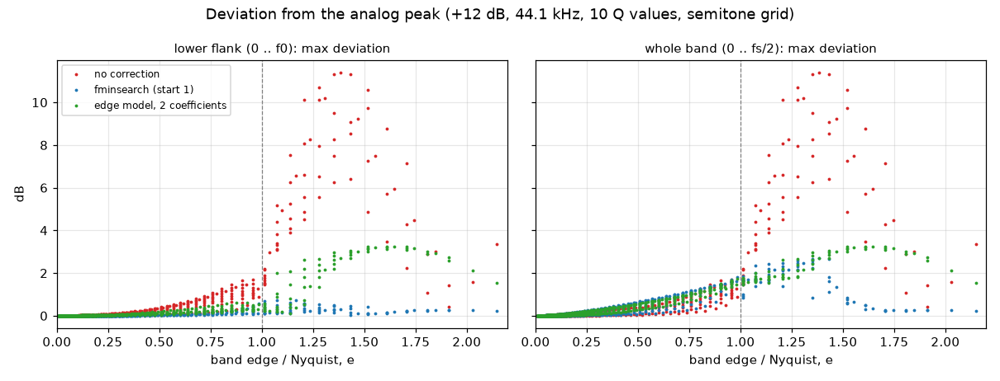

# Side study: a simple function for the Q correction of the Orfanidis peak

Status: study, 2026-10-09. Low priority, no change to the pluginlab code.
Code: `~/AudioDev/measurement_tool/studies/orfanidis_q/` (see its README; two scripts, about one minute on 16 cores).

## 1. Question

The Orfanidis peak (`designOrfanidisPeak` in `src/reference/Designs.cpp`) deviates from the analog peak when the band
reaches Nyquist (15 kHz, Q 0.71, 44.1 kHz: 5.3 dB at +6 dB, 10.3 dB at +12 dB). Schmidt and Bitzer (2010) correct the
Q used in the design with an fminsearch optimisation and store the result as a matrix over frequency and Q.
Can this matrix be replaced by a simple 2-D polynomial, or by a product of a function of frequency and a function of Q?

## 2. What the paper and the MATLAB code do

T. Schmidt, J. Bitzer, "Digital equalization filter: New solution to the frequency response near Nyquist and evaluation
by listening tests", AES 128th Convention, London, 2010 May 22-25 (convention paper), section 2.2.3 "Orfanidis with
modification".

From the MATLAB code (`matlab/QCorrectionList/FindOptQOrfan.m`, `CompareDesigns.m`, `BLT/getPeak_BLT_Orfanidis.m`,
`Analog/getPeak_Analog.m`):

- **Reference:** the analog peak H(s) = (s² + s w0 A/Q + w0²) / (s² + s w0/(A Q) + w0²), A = 10^(G/40), evaluated at
  the same normalised frequency as the digital filter (no prewarping). The band edges are at half the gain in dB.
- **Digital design:** Orfanidis' `peq.m` with G0 = 1, GB = half the gain in dB, Dw = w0 / Q_design. This is the same
  formula as pluginlab's `designOrfanidisPeak` (checked line by line).
- **What is optimised:** a factor QCorr; the filter is designed with Q_design = QCorr · Q. Start value 1, `fminsearch`
  (Nelder-Mead, default tolerances 1e-4).
- **Error criterion:** sum over the frequency bins from 0.05 w0 to w0 of |abs(H_analog) - abs(H_digital)|, i.e. the L1
  norm of the linear magnitude difference on the lower flank only. 2048 bins from 0 to Nyquist.
- **Setup:** fs = 44.1 kHz, gain +12 dB only. The paper states that the gain has no influence on the optimised Q.
- **Q values (10):** 0.5557, 0.6667, 0.7071, 0.8193, 1.0445, 1.4142, 2.1449, 4.3185, 8.6514, 17.31, i.e. bandwidths of
  about 2.33, 2, 1.9, 1.67, 1.33, 1, 2/3, 1/3, 1/6 and 1/12 octave.
- **Frequencies:** the code uses `GenFreqList(440, 3)`: 44 frequencies in steps of three semitones, 13.75 Hz to
  23.7 kHz (the last one is above Nyquist). The 127 frequencies of the paper are most likely the semitone grid
  `GenFreqList(440, 1, 16, 22050)`, which has exactly 127 entries (the last, 22.35 kHz, is above Nyquist). This is my
  inference; the 127 x 10 matrix is not in the material.
- **Paper version:** Fig. 10 of the paper (script `PaperFigs/ShowAnaOrfanDiffpeakMod.m`) uses the "Orfanidis with
  modification" (`getPeak_BLT_OrfanidisRBJ.m`): if the analog gain at Nyquist is beyond the half gain (the upper band
  edge lies above Nyquist), the band is defined between fs/2 and a lower frequency fu = fc^(ln fc / ln(fs/2)) with the
  analog Nyquist gain as GB. The figure script runs fminsearch for each frequency; it does not use a stored matrix.
- **MATLAB grid quirk:** the analog response is taken on `linspace(0, pi, 2048)`, the digital one from `freqz` on the
  bins k·pi/2048. The two grids differ by the factor 2047/2048. This changes QCorr by up to 0.017. The reproduction
  below keeps the quirk; the study itself uses the exact grid.

## 3. Reproduction and the stored matrix

The only stored matrix is `QCorrecFaktor.cpp` (`const float QCorr[10][44]`). All three `FindOptQ*.m` scripts write to
this file name. My reproduction (same criterion, same grid, scipy Nelder-Mead with the fminsearch start simplex and
tolerances) shows that the stored file is the correction for the **RBJ cookbook peak** (`FindOptQBLT.m`), not for
Orfanidis:

| design used in the reproduction | median abs diff | max abs diff | entries within 1e-3 (of 430) |
|---|---|---|---|
| RBJ cookbook peak (`getPeak_BLT.m`, `FindOptQBLT.m`) | 2.5e-08 | 0.2 | 422 |
| Orfanidis (`getPeak_BLT_Orfanidis.m`, `FindOptQOrfan.m`) | 0.0013 | 1.98 | 209 |
| Orfanidis with modification (`getPeak_BLT_OrfanidisRBJ.m`) | 0.0013 | 1.33 | 209 |

(The last column, 23.7 kHz, is above Nyquist and left out.) The 8 RBJ entries that differ are all at 13.75 Hz, where
the criterion covers a single bin and the minimum is not defined. So the fminsearch reproduction is exact. The stored
RBJ matrix falls from 1 to about 0.2 at 19.9 kHz and depends only weakly on Q; it is not studied further here.

The Orfanidis matrix was therefore recomputed: semitone grid (126 frequencies below Nyquist) x 10 Q values, +12 dB,
44.1 kHz, exact grid (file `out/matrices.npz`).

## 4. Structure of the Orfanidis correction

A useful variable is the upper band edge of the wanted analog peak relative to Nyquist:

e = (2 f0 / fs) · (1/(2Q) + sqrt(1 + 1/(4Q²)))

(the band edges at half gain satisfy f1 f2 = f0² and f2 - f1 = f0/Q). Two regions follow:

- **Region A, e < 1 (band edge below Nyquist).** QCorr rises smoothly from 1 to about 1.3 as e approaches 1. Plotted
  against e, the ten Q curves almost fall onto one curve. QCorr > 1 means a narrower designed band: it makes the lower
  flank fit; in exchange the upper flank (between f0 and Nyquist) gets worse.
- **Region B, e >= 1 (band edge above Nyquist).** QCorr is not a smooth function. It first rises steeply (up to 2.4),
  then jumps to values around 0.5 to 1.2. Reasons: (1) the criterion has two local minima here (example: 14.08 kHz,
  Q 1.0445 has minima at QCorr 1.03 and 1.23); (2) the Orfanidis formulas contain sqrt(F00/F11) with F11 = |GB² - G1²|,
  which is singular when the designed band edge is exactly at Nyquist; (3) for small QCorr the designed bandwidth
  Dw = w0/Q_design exceeds pi; because the formulas use only Dw² and tan²(Dw/2), this gives a second, "aliased" family
  of filters, and for low Q near Nyquist this family has the smallest error. A global search over QCorr (241 start
  values) does not remove the jumps; it is not better in dB than fminsearch from 1 (table below).

Region B occurs at 44.1 and 48 kHz for low Q at high frequencies (Q 0.71: f0 above about 11.4 kHz at 44.1 kHz). At
96 kHz no point up to 20 kHz lies in region B for the ten Q values.

## 5. Filter error measures

For each design: the largest |dB(H_digital) - dB(H_analog)| on 4096 frequencies,

- **lower:** from 0 to f0 (the range of the paper's criterion),
- **full:** from 0 to Nyquist (what pluginlab's test reports as "largest deviation from the analog peak").

Maxima and medians are taken over all grid points with f0 >= 200 Hz in region A (742 points) and over all points in
region B (68 points). Below 200 Hz the criterion has fewer than about 20 bins and QCorr is 1 anyway.

## 6. Approximations

All models approximate ln QCorr. x = 2 f0/fs, y = log2 Q, e as above. The models are fitted by least squares on region
A (f0 >= 200 Hz). In region B they are extrapolated (clipped to 0.25 ... 4). "rms %" and "max %" are the errors of
ln QCorr on the fit domain (x100, i.e. about percent of QCorr).

| model | coef. | rms % | max % | A lower max | A full max | B lower max | B full max | B full median |
|---|---|---|---|---|---|---|---|---|
| no correction | - | - | - | 1.71 | 1.71 | 11.41 | 11.41 | 5.22 |
| fminsearch, start 1 (the paper) | table | - | - | 0.59 | 1.81 | 0.73 | 2.71 | 1.64 |
| fminsearch, global start | table | - | - | 0.59 | 1.81 | 0.73 | 3.06 | 1.59 |
| **a. 2-D polynomials** | | | | | | | | |
| poly deg 2 in (x, y) | 6 | 1.25 | 9.7 | 0.67 | 1.74 | 11.91 | 11.91 | 3.07 |
| poly deg 3 in (x, y) | 10 | 0.67 | 5.8 | 0.43 | 1.77 | 4.59 | 4.59 | 1.99 |
| poly deg 4 in (x, y) | 15 | 0.28 | 2.2 | 0.49 | 1.70 | 2.83 | 2.83 | 1.90 |
| poly deg 5 in (x, y) | 21 | 0.14 | 1.6 | 0.52 | 1.73 | 3.04 | 3.04 | 2.00 |
| poly deg 6 in (x, y) | 28 | 0.07 | 0.9 | 0.56 | 1.78 | 11.46 | 11.46 | 2.32 |
| poly deg 3 in (log2 x, y) | 10 | 1.18 | 11.4 | 0.51 | 1.49 | 11.54 | 11.54 | 3.68 |
| poly deg 4 in (log2 x, y) | 15 | 0.71 | 9.6 | 0.46 | 1.59 | 10.83 | 10.83 | 2.81 |
| poly deg 5 in (log2 x, y) | 21 | 0.49 | 7.7 | 0.40 | 1.62 | 5.06 | 5.06 | 2.18 |
| poly deg 6 in (log2 x, y) | 28 | 0.36 | 6.0 | 0.37 | 1.64 | 3.12 | 3.12 | 2.09 |
| **b. separable** | | | | | | | | |
| QCorr = F(f) G(Q) (ln: u(f) + v(Q)), table | 135 | 2.36 | 11.2 | 0.91 | 1.81 | 11.98 | 11.98 | 4.62 |
| rank-1 of ln QCorr, a(f) b(Q), table | 135 | 0.15 | 1.0 | 0.59 | 1.81 | 4.68 | 4.77 | 2.46 |
| rank-2 of ln QCorr, table | 268 | 0.01 | 0.05 | 0.59 | 1.80 | 10.49 | 10.49 | 2.30 |
| rank-1 product, a(x) deg 3, b(y) deg 1 | 4 | 1.66 | 17.8 | 0.78 | 1.69 | 11.60 | 11.60 | 3.52 |
| rank-1 product, a(x) deg 4, b(y) deg 2 | 6 | 0.89 | 7.1 | 0.49 | 1.80 | 4.21 | 4.21 | 1.98 |
| rank-1 product, a(x) deg 5, b(y) deg 2 | 7 | 0.76 | 4.6 | 0.57 | 1.80 | 5.32 | 5.32 | 2.41 |
| rank-1 product, a(x) deg 6, b(y) deg 3 | 9 | 0.38 | 2.7 | 0.57 | 1.71 | 4.48 | 4.54 | 2.42 |
| **c. band edge e (my idea)** | | | | | | | | |
| c e² | 1 | 1.35 | 8.0 | 0.59 | 1.71 | 4.05 | 4.05 | 2.60 |
| poly deg 2 in e (no constant) | 2 | 1.32 | 8.2 | 0.62 | 1.74 | 3.25 | 3.25 | 2.15 |
| poly deg 3 in e | 3 | 1.30 | 8.2 | 0.65 | 1.80 | 2.56 | 3.09 | 2.00 |
| poly deg 4 in e | 4 | 1.30 | 8.1 | 0.65 | 1.82 | 5.48 | 5.48 | 2.15 |
| deg 2 in e x deg 1 in y | 4 | 0.54 | 8.8 | 0.43 | 1.64 | 2.90 | 2.90 | 2.09 |
| deg 3 in e x deg 1 in y | 6 | 0.30 | 4.4 | 0.40 | 1.66 | 6.08 | 6.08 | 2.03 |
| deg 3 in e x deg 2 in y | 9 | 0.29 | 3.9 | 0.42 | 1.64 | 5.11 | 5.11 | 2.05 |
| deg 4 in e x deg 2 in y | 12 | 0.18 | 2.0 | 0.52 | 1.73 | 10.45 | 10.45 | 2.20 |

Observations:

- **Region A is easy.** Every model with 2 or more well-chosen coefficients reproduces the effect of the full
  fminsearch result: lower-flank error 0.4 ... 0.65 dB against 0.59 dB (fminsearch) and 1.71 dB (none). Several fits
  are even better than fminsearch in dB, because the paper's criterion (L1 of the linear magnitude) is not the max dB
  error. A 2-D polynomial in (x, log Q) needs degree 3 to 4 (10 to 15 coefficients). Polynomials in log frequency are
  worse: the correction sits in the upper part of the band (above about fs/8), which a log frequency axis compresses.
- **Separation works partly.** QCorr = F(f) · G(Q) fails (11 % max error): at low frequencies QCorr = 1 for every Q, so
  a pure product cannot carry a Q dependence. The rank-1 form ln QCorr = a(f) · b(Q) works well (1 % max as a table,
  7 % with polynomial factors of 6 coefficients); rank 2 is practically exact in region A.
- **The band edge e is the natural variable.** One coefficient, QCorr = exp(0.193 e²), already gives the lower-flank
  error of the full fminsearch (0.59 dB). Adding a linear term in log2 Q captures the residual Q dependence.
- **The correction does not reduce the full-band error in region A.** It moves the error from the lower to the upper
  flank: full-band max 1.71 dB (none) against 1.81 dB (fminsearch) and 1.64 ... 1.80 dB (fits). Example: 10 kHz, Q 1,
  +12 dB, 48 kHz: full-band max 0.61 dB without correction, 0.93 dB with fminsearch, 0.88 dB with the 2-coefficient
  model; the lower flank improves from 0.61 to 0.08 / 0.13 dB.
- **Region B is not reproduced by any smooth function.** The fminsearch result brings the error from 11.4 dB down to
  2.7 dB. Extrapolated fits give 2.8 ... 12 dB, depending on the model more than on its accuracy in region A
  (higher degree usually means worse extrapolation). The low-order edge models give 3.1 ... 3.3 dB, which is a large
  improvement over no correction, but they do not reach the "aliased" branch where fminsearch finds errors of 0.2 to
  0.5 dB for low Q near Nyquist (figure below).

**Off grid** (quarter tones between the fit frequencies, 750 points in A, 60 in B) the closed-form models behave the
same: e.g. 2-coefficient edge model A 0.61 / 1.77 dB, B 3.25 dB; 2-D polynomial deg 4 A 0.53 / 1.82 dB, B 2.81 dB;
no correction A 1.71, B 11.68 dB. No sign of over-fitting.

## 7. Dependence on gain

fminsearch matrices for ±3, ±6, ±12, ±18 dB. In region A the boost matrices differ from +12 dB by at most 2 % in
QCorr; the cut matrices by up to 14 % (-18 dB), because the linear-magnitude criterion weights a dip differently from a
peak. In dB, however, the Orfanidis cut is the exact inverse of the boost (GB is the geometric mean; checked numerically,
|H(+g) H(-g)| = 1 within 1e-14), so a correction gives the same dB error for +g and -g. Using the +12 dB correction for cuts is better than the cut's own fminsearch.

Region A lower / full max in dB, and region B full max in dB; all fits are the +12 dB fits:

| gain | none A | none B | own fminsearch A (boost; cut in brackets) | own B (boost) | +12 dB fminsearch A | B | edge 2 coef. A | B | edge 6 coef. A | B | 2-D poly deg 4 A | B |
|---|---|---|---|---|---|---|---|---|---|---|---|---|
| ±3 dB | 0.49 / 0.49 | 2.89 | 0.18 / 0.54 (cut 0.22 / 0.57) | 0.73 | 0.16 / 0.51 | 0.72 | 0.17 / 0.50 | 0.92 | 0.11 / 0.47 | 1.68 | 0.13 / 0.48 | 0.80 |
| ±6 dB | 0.94 / 0.94 | 5.76 | 0.34 / 1.03 (cut 0.47 / 1.15) | 1.44 | 0.31 / 1.00 | 1.42 | 0.34 / 0.96 | 1.79 | 0.21 / 0.92 | 3.28 | 0.26 / 0.94 | 1.56 |
| ±12 dB | 1.71 / 1.71 | 11.41 | 0.59 / 1.81 (cut 1.05 / 2.27) | 2.71 | 0.59 / 1.81 | 2.71 | 0.62 / 1.74 | 3.25 | 0.40 / 1.66 | 6.08 | 0.49 / 1.70 | 2.83 |
| ±18 dB | 2.22 / 2.22 | 16.80 | 0.78 / 2.32 (cut 1.67 / 3.23) | 3.80 | 0.82 / 2.35 | 3.87 | 0.82 / 2.27 | 4.27 | 0.57 / 2.16 | 8.13 | 0.69 / 2.22 | 3.70 |

The errors scale roughly with the gain; the relative benefit of each correction does not depend on the gain. The
paper's statement (one matrix for all gains) holds, if the cut uses the boost's correction.

## 8. Dependence on the sample rate

The criterion and both designs depend only on w0 = 2 pi f0/fs, Q and the gain. Computed at 48 and 96 kHz on the same
normalised frequencies, the matrices are identical to the 44.1 kHz matrix (difference 0). A correction written as a
function of f0/fs (x or e) is therefore valid for every sample rate. On a fixed audio band (200 Hz ... 20 kHz) higher
rates simply use the lower part of the function:

| fs | points A / B | none A / B | own fminsearch A / B | edge 2 coef. A / B |
|---|---|---|---|---|
| 44.1 kHz | 741 / 59 | 1.71 / 11.41 | 0.48, 1.70 / 2.71 | 0.62, 1.68 / 3.25 |
| 48 kHz | 755 / 45 | 1.71 / 11.79 | 0.39, 1.68 / 2.70 | 0.58, 1.69 / 3.23 |
| 96 kHz | 800 / 0 | 1.71 / - | 0.08, 1.55 / - | 0.38, 1.31 / - |

(A: lower max, full max; B: full max; dB, +12 dB.) The largest error in region A without correction (1.71 dB) is
always at Q 0.5557 with e between 0.93 and 0.96, which exists at every rate.

## 9. Side check: the paper's "Orfanidis with modification"

In region A the modified design is the plain design, and its fminsearch matrix is identical there. In region B the
modification itself helps more than a Q correction of the plain design:

| design (+12 dB, 44.1 kHz) | A lower max | A full max | B lower max | B full max | B full median |
|---|---|---|---|---|---|
| Orfanidis, no correction | 1.71 | 1.71 | 11.41 | 11.41 | 5.22 |
| Orfanidis, fminsearch | 0.59 | 1.81 | 0.73 | 2.71 | 1.64 |
| with modification, no correction | 1.71 | 1.71 | 2.33 | 2.33 | 0.95 |
| with modification, fminsearch | 0.59 | 1.81 | 0.65 | 1.71 | 0.96 |
| with modification, 2-coef. edge model for e < 1 only | 0.62 | 1.74 | 2.33 | 2.33 | 0.95 |

Caveat: the lower frequency fu = fc^(ln fc / ln(fs/2)) of the modification is a heuristic in Hz; it is not a function
of f/fs and does not depend on Q, and the design switches its rule at e = 1. I did not check the continuity of the
response across e = 1 or other sample rates for the modification.

## 10. Recommendation

1. **Region A (band edge below Nyquist): yes, a simple function is good enough.** Recommended, for any sample rate and
   gain (use |gain|):

   e = (2 f0/fs) · (1/(2Q) + sqrt(1 + 1/(4Q²))),  QCorr = exp(-0.023192 e + 0.223962 e²),  Q_design = QCorr · Q.

   Two coefficients; 1.3 % rms, 8 % max deviation from the fminsearch matrix; lower-flank error 0.62 dB against
   0.59 dB (fminsearch) and 1.71 dB (none). The one-coefficient form exp(0.193 e²) is equivalent in region A (0.59 dB)
   but worse in region B (4.0 against 3.3 dB). If the residual Q dependence matters, the 6-coefficient form
   ln QCorr = sum_{k=1..3} e^k (c_k0 + c_k1 log2 Q) with c_10 = -0.003121, c_11 = +0.017456, c_20 = +0.208736,
   c_21 = -0.146752, c_30 = +0.019352, c_31 = +0.117115 gives 0.40 dB on the lower flank, but use it only for e < 1.
   A 2-D polynomial needs 10 to 15 coefficients for similar accuracy; a separable product needs 6 (a(x) deg 4 times
   b(log2 Q) deg 2; coefficients in `out/tables.md`).
2. **Be aware of the trade-off.** In region A the correction does not lower the full-band maximum; it moves the error
   to the upper flank (e.g. 0.61 -> 0.88 dB at 10 kHz, Q 1, 48 kHz). Whether this is wanted depends on the goal: the
   paper argues that the ear is less sensitive above f0. pluginlab's test "closer to the analog curve than RBJ" uses the
   full-band maximum; a corrected design would have to be checked against it.
3. **Region B (band edge above Nyquist): no simple function reproduces the fminsearch matrix.** The 2-coefficient model
   still reduces the error from 11.4 to 3.3 dB (fminsearch: 2.7 dB). Better options: the paper's modified design
   (2.3 dB without any correction, 1.7 dB with fminsearch), running fminsearch at design time (a few dozen evaluations of a
   2048-point response, cheap for a reference design, not for per-sample automation), or one of the other designs of
   the paper (MiMa, FDLS, oversampling), which were not part of this study.

## 11. Limits and what was not checked

- The criterion is the paper's (L1, linear magnitude, lower flank). A correction optimised for the full-band max dB
  error would be different; a quick probe showed the same two-branch structure in region B, so it was not pursued.
- Ten Q values from 0.5557 to 17.3 and the semitone grid only; Q below 0.55 was not checked.
- The 127 x 10 Orfanidis matrix of the paper is not in the material; the comparison with a stored matrix was only
  possible for the RBJ matrix. The frequency grid of 127 points is my inference.
- Gains ±3 ... ±18 dB only. Phase was not considered.
- Fitting weights all grid points equally; no perceptual weighting.
- The RBJ correction matrix (the stored one) is smooth and nearly Q independent; its approximation was not studied.
- No pluginlab code was changed; the formula above is not implemented or tested in C++.
