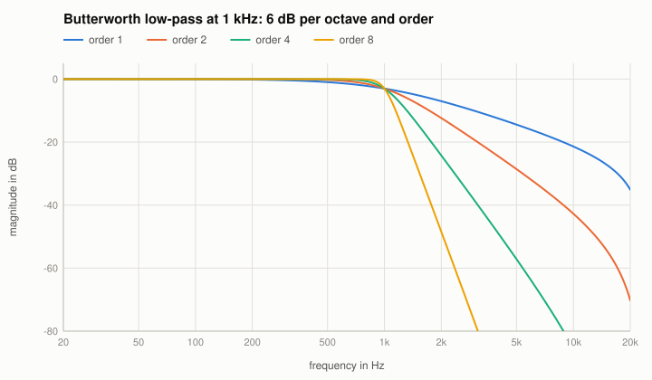
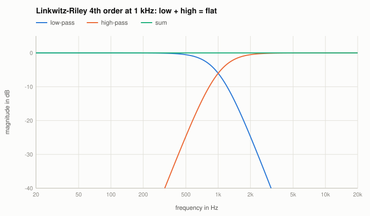

# Butterworth and Linkwitz-Riley

Code: `designButterworth`, `designLinkwitzRiley` in `src/reference/Designs.cpp`; in the Reference EQ: algorithms "Butterworth" (order 1 ... 8) and
"Linkwitz-Riley" (2, 4, 8), types low-pass and high-pass.

## Butterworth
The maximally flat low-pass of order $N$: $|H(j\Omega)|^2 = \dfrac{1}{1 + \Omega^{2N}}$ ($\Omega = f/f_c$ of the analog prototype). It is built from
second-order sections with

$$Q_k = \frac{1}{2\sin\!\big((2k + 1)\pi / (2N)\big)},\quad k = 0 \dots N/2 - 1,$$

plus a first-order section $1/(s + 1)$ for odd $N$; each section by the bilinear transform pre-warped at $f_c$. The gain at $f_c$ is -3.01 dB for every
order, the slope far above it $6N$ dB per octave. High-pass: $s \to 1/s$.

## Linkwitz-Riley
The Butterworth of half the order, twice in series: LR2 = BW1$^2$, LR4 = BW2$^2$, LR8 = BW4$^2$. The gain at $f_c$ is -6.02 dB, and the sum of the
low-pass and the high-pass (the high-pass inverted for LR2) is an **all-pass**: a crossover whose bands add up to a flat magnitude.

## The known answer
The tests: $|H|^2 = 1/(1 + \Omega_w^{2N})$ at the warped frequency within 1e-12 for orders 1 ... 8 at three sample rates; -3.0103 dB / -6.0206 dB at
the corner; the LR sum is an all-pass within 1e-12; the oracle compares order 5 with `scipy.signal.butter` (3e-13 dB).
