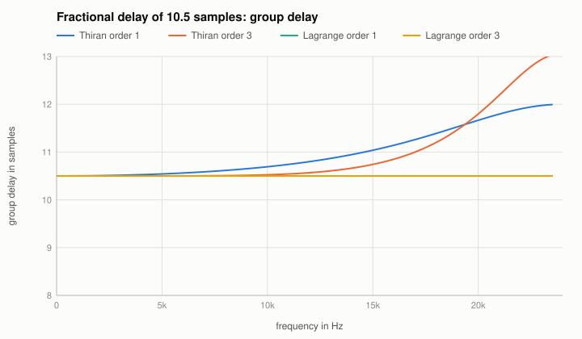
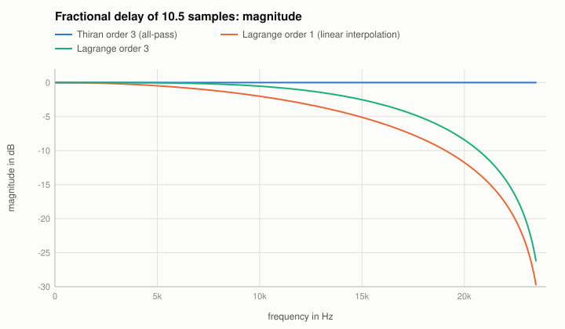

# Fractional delays

Code: `makeIntegerDelay`, `makeThiranDelay`, `makeLagrangeDelay` in `src/reference/Delays.cpp`; in the Reference Utility: "Delay" with "Interpolation".

A delay of $D$ samples has $H = e^{-j\omega D}$: magnitude 1, group delay $D$. For whole $D$ that is a delay line; for a fraction it has to be
approximated. Both methods below split $D$ into whole samples (a delay line) and a short filter around the fractional part.

## Thiran all-pass
An all-pass of order $N$ with maximally flat group delay at DC:

$$a_k = (-1)^k \binom{N}{k} \prod_{n=0}^{N} \frac{D - N + n}{D - N + k + n},\qquad H(z) = z^{-N}\,\frac{A(z^{-1})}{A(z)}$$

(the numerator is the denominator reversed), stable for $D > N - 1$; the code uses $D$ in $[N - 0.5, N + 0.5)$. $|H| = 1$ at every frequency; the group
delay is $D$ at DC and deviates towards Nyquist.

## Lagrange interpolation
An FIR of order $N$ whose taps are the Lagrange polynomial weights:

$$h_k = \prod_{n \ne k} \frac{D - n}{k - n},\quad k = 0 \dots N,$$

with $D$ in the middle interval of the taps ($[0, 1)$ for order 1, $[1, 2)$ for order 3): there it interpolates; outside it would extrapolate and
amplify the high frequencies. Maximally flat at DC: gain 1 and group delay $D$ there; the magnitude falls towards Nyquist and never exceeds 1 (order 1
is linear interpolation: 0 at Nyquist for half a sample). At exactly half a sample the taps are symmetric: the phase is linear, the group delay is
exactly $D$ at all frequencies (the two Lagrange curves of the first figure lie on top of each other), only the magnitude falls.

## The known answer
Tests: Thiran orders 1 ... 4 have $|H| = 1$ within 1e-12 and the delay at DC within 1e-6 samples; Lagrange the delay and gain 1 at DC and never a gain
above 1. (That last test came from the figure above: the first version placed the fraction of odd orders outside the middle interval, and the
magnitude of linear interpolation rose above 0 dB. The tests at DC had not seen it.) The oracle
compares the Thiran coefficients for 37.25 samples (order 3) with a Python implementation (1e-12) and the group delay with `scipy.signal.group_delay`.
