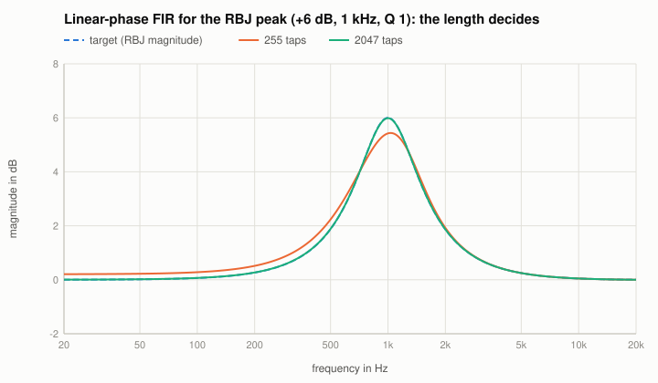
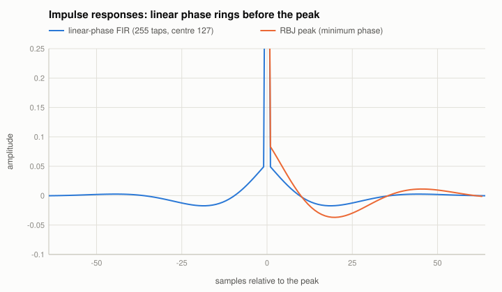

# Linear-phase FIR filters

Code: `designLinearPhaseFir`, `makeLinearPhaseFir` in `src/reference/LinearPhaseFir.cpp`.

## The design
A target magnitude $|H(f)|$ (here: the magnitude of the RBJ peak) is sampled on a dense frequency grid with zero phase, transformed to the time domain
(an inverse DFT of a real, even spectrum), cut to $N$ taps (odd) around the centre and shaped with a Blackman window. The taps are symmetric,
$h[n] = h[N - 1 - n]$, so

$$H(e^{j\omega}) = e^{-j\omega (N-1)/2}\, R(\omega),\quad R \text{ real}:$$

the phase is exactly linear, i.e. a pure delay of $(N - 1)/2$ samples (the latency a host must compensate), and the magnitude approximates the target.

## The known answer
- The taps are exactly symmetric; the phase without the delay is zero within 1e-9 (test).
- With 2047 taps the magnitude is within 0.011 dB of the target from 100 Hz to 20 kHz; with 255 taps the low frequencies are lost (the frequency
  resolution of $N$ taps is about $f_s / N$ = 190 Hz):

- The price of linear phase: the impulse response is symmetric around its peak, so energy comes **before** the main peak (pre-ringing), while the
  minimum-phase RBJ filter rings only after it:

Things to listen for: the same magnitude with and without linear phase on a drum loop (pre-ringing of a strong boost or a steep low cut), and the
latency on the plugin's report.
