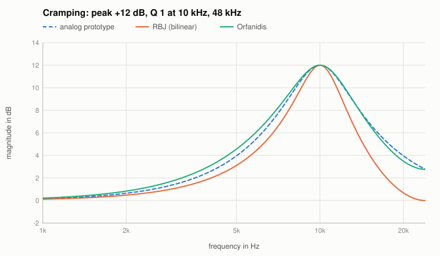

# Cramping and the Orfanidis peak

Code: `designOrfanidisPeak` in `src/reference/Designs.cpp`; in the Reference EQ: algorithm "Orfanidis" (type peak).

## Cramping
The bilinear transform maps the whole analog frequency axis $0 \dots \infty$ onto $0 \dots f_s/2$. A digital RBJ peak at 10 kHz (48 kHz) is therefore
the analog peak with its upper half squeezed into the few kHz up to Nyquist: it is narrower than the analog curve, and at Nyquist its gain is
exactly 0 dB, where the analog peak still has several dB. This is "cramping"; it is audible as a different high-frequency shelf of the band.

## Orfanidis: prescribed Nyquist gain
S. J. Orfanidis, "Digital parametric equalizer design with prescribed Nyquist-frequency gain", JAES 45(6), 1997, designs the biquad so that its
gain at Nyquist equals the gain of the analog prototype there:

$$G_1^2 = \frac{G_0^2 (\omega_0^2 - \pi^2)^2 + G^2 \pi^2 \Delta\omega^2 F_{00}/F}{(\omega_0^2 - \pi^2)^2 + \pi^2\Delta\omega^2 F_{00}/F},
\quad F = |G^2 - G_B^2|,\; F_{00} = |G_B^2 - G_0^2|$$

with the reference gain $G_0 = 1$, the peak gain $G$, the gain at the band edges $G_B = \sqrt{G G_0}$ (half the gain in dB) and the bandwidth
$\Delta\omega = \omega_0 / Q$; the coefficients follow from the paper (and its `peq.m`). With this choice of $G_B$ and $\Delta\omega$ the analog prototype
is exactly the RBJ analog peak, so the two designs can be compared directly.

## The known answer
The design hits $G$ at $f_0$, 1 at DC and the analog gain $G_1$ at Nyquist exactly (tests: within 1e-6 dB). Between, it follows the analog curve much
closer than RBJ: for +12 dB, $Q = 1$ at 10 kHz the largest deviation from the analog peak is 0.6 dB (Orfanidis) against 3.3 dB (RBJ) at 48 kHz,
0.2 dB against 0.9 dB at 96 kHz.

Limit: the band must lie below Nyquist (roughly $f_0 (1 + 1/(2Q)) < f_s/2$). For 15 kHz with $Q = 0.71$ at 44.1 kHz the band reaches beyond Nyquist and
Orfanidis is worse than RBJ (5.3 dB against 4.6 dB).
