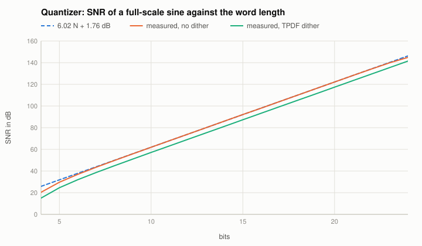
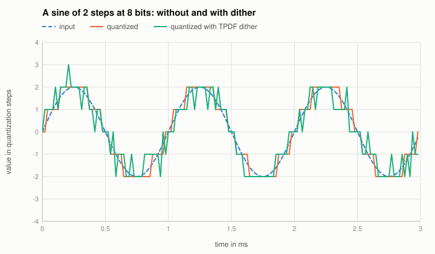

# Quantizer and dither

Code: `Quantizer` in `src/reference/Nonlinear.cpp`; in the Reference Nonlinear: "Quantizer", "Bits".

## Quantization noise
$N$ bits for the range $\pm 1$: step $q = 2^{1-N}$, rounding to the nearest step (mid-tread, so silence stays silence). If the error is uniform in
$\pm q/2$ and independent of the signal, its power is $q^2/12$; a sine of amplitude $A$ has the power $A^2/2$:

$$\text{SNR} = 10\log_{10}\frac{A^2/2}{q^2/12} = 6.02\,N + 1.76\ \text{dB} + 20\log_{10}A .$$

## Dither
For small signals the error is **not** independent: it is a distorted copy of the signal (harmonics). TPDF dither (the sum of two uniform values in
$\pm q/2$, added before rounding) makes the error independent of the signal, at the price of more noise: $q^2/12 + q^2/6 = q^2/4$, i.e. **4.77 dB** less SNR.

## The known answer
Tests: SNR within 0.1 dB of the formula at 8, 12 and 16 bits, with and without dither (16 bits: 98.05 dB measured, 98.09 dB formula). A sine of 2 steps
at 8 bits: the third harmonic at -34 dB re the fundamental without dither, below the noise (-48 dB in one DFT bin) with dither. Oracle: 16 bits
98.0485 dB in Python and C++ (the remaining 0.04 dB to the formula: a deterministic sine does not make the error quite uniform).
