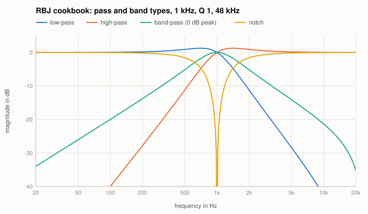
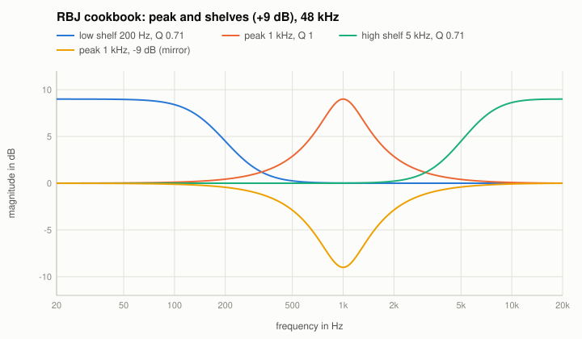
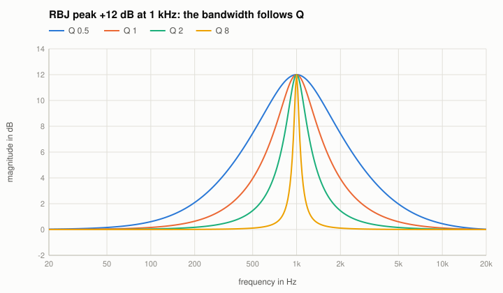
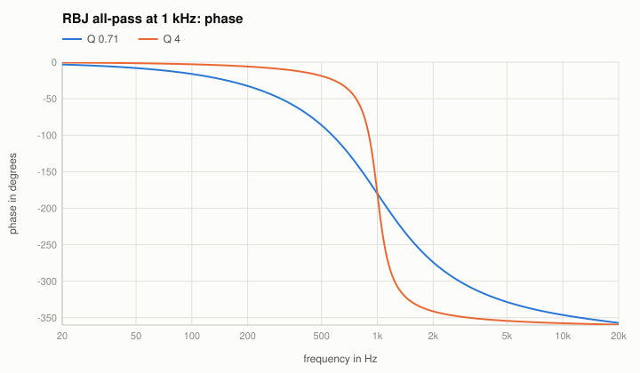

# The RBJ audio EQ cookbook

Robert Bristow-Johnson's "Cookbook formulae for audio EQ biquad filter coefficients" is the design most EQ plugins use. Code: `designRbj` in
`src/reference/Designs.cpp`, analog prototypes in `src/reference/Analog.cpp`; in the Reference EQ: algorithm "RBJ cookbook".

## The idea: an analog prototype and the bilinear transform
Each type is a second-order analog filter $H(s)$, with $s$ normalised so that $s = j$ at $f_0$. With $A = 10^{G/40}$ (half the gain $G$ in dB as a factor)
and the quality factor $Q$:

| Type | $H(s)$ |
|---|---|
| low-pass | $\dfrac{1}{s^2 + s/Q + 1}$ |
| high-pass | $\dfrac{s^2}{s^2 + s/Q + 1}$ |
| band-pass (constant skirt, peak gain $Q$) | $\dfrac{s}{s^2 + s/Q + 1}$ |
| band-pass (0 dB peak) | $\dfrac{s/Q}{s^2 + s/Q + 1}$ |
| notch | $\dfrac{s^2 + 1}{s^2 + s/Q + 1}$ |
| all-pass | $\dfrac{s^2 - s/Q + 1}{s^2 + s/Q + 1}$ |
| peak | $\dfrac{s^2 + s\,A/Q + 1}{s^2 + s/(A Q) + 1}$ |
| low shelf | $A\,\dfrac{s^2 + s\sqrt{A}/Q + A}{A s^2 + s\sqrt{A}/Q + 1}$ |
| high shelf | $A\,\dfrac{A s^2 + s\sqrt{A}/Q + 1}{s^2 + s\sqrt{A}/Q + A}$ |

The digital filter comes from the bilinear transform $s = \dfrac{1}{\tan(\omega_0/2)}\,\dfrac{1 - z^{-1}}{1 + z^{-1}}$, pre-warped so that $f_0$ stays
where it is. In coefficients, with $\alpha = \sin\omega_0 / (2Q)$, e.g. the peak:

$$H(z) = \frac{(1 + \alpha A) - 2\cos\omega_0\, z^{-1} + (1 - \alpha A)\, z^{-2}}{(1 + \alpha/A) - 2\cos\omega_0\, z^{-1} + (1 - \alpha/A)\, z^{-2}}$$

(the cookbook lists all nine; the code follows it line by line).

## The known answer
Because of the bilinear transform the digital response at a frequency $f$ is **exactly** the analog response at the warped frequency

$$f_w = f_0\,\frac{\tan(\pi f / f_s)}{\tan(\pi f_0 / f_s)} .$$

Below about $f_s/10$ the two hardly differ; towards Nyquist the digital curve is squeezed (next page: cramping). The tests check this identity for all
nine types at 44.1, 48 and 96 kHz (largest difference 9e-10 dB), and the oracle compares them with scipy's own bilinear transform of the same
prototypes (1e-11 dB).

The peak and the shelves cut by the inverse of their boost (the curve for -9 dB is the mirror of +9 dB). The width of the peak is set by $Q$:

The all-pass keeps the magnitude at 0 dB and turns the phase by 360 degrees around $f_0$, the faster the higher $Q$:

## Other ways to give the width
- **Bandwidth in octaves** $BW$ (between the half-gain points in dB of the peak, the -3 dB points of band-pass and notch):
  $1/Q = 2\sinh\!\left(\frac{\ln 2}{2}\,BW\,\frac{\omega_0}{\sin\omega_0}\right)$ (`getQFromBandwidth`). The factor $\omega_0/\sin\omega_0$ corrects the warping only
  approximately: 1 octave asked gives 0.9997 octaves at 1 kHz, but 0.988 octaves at 10 kHz (48 kHz).
- **Shelf slope** $S$: $1/Q = \sqrt{(A + 1/A)(1/S - 1) + 2}$; $S = 1$ is the steepest slope without overshoot ($Q = 1/\sqrt2$ for every gain).

## Things to try (Reference EQ)
- A peak at 1 kHz and one at 15 kHz with the same $Q$: listen and measure; the high one is narrower than its $Q$ says (cramping).
- A low shelf with $Q = 2$: the overshoot below and above the corner.
- The all-pass on one channel only: nothing changes in the magnitude, but the stereo image does.
