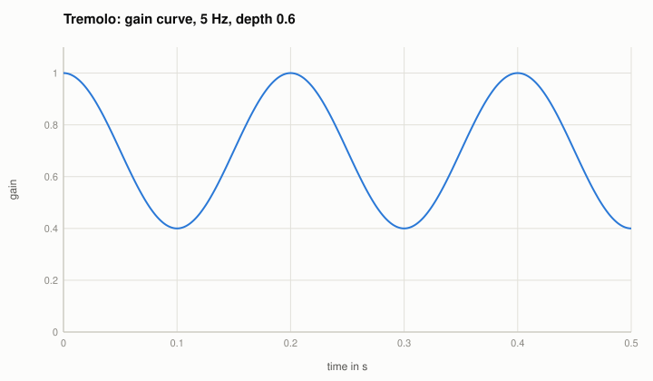

# Utilities: gain, polarity, channel matrix, DC, hum, noise, tremolo

Code: `src/reference/Utility.cpp`; in the Reference Utility (gain, polarity, delay, width, crosstalk, DC, tremolo) and the Reference Nonlinear (hum,
noise). Their answers are exact; they are the simple, known signals that measurements and the fingerprint must find.

- **Gain and polarity:** $y = \pm g\,x$, $g = 10^{G/20}$. A polarity inversion is invisible in the magnitude and obvious in a null test.
- **Channel matrix:** $L' = a L + b R$, $R' = c L + d R$.
  - Stereo width $w$ (M/S): $M = (L + R)/2$, $S = w(L - R)/2$, $L' = M + S$, $R' = M - S$; $w = 0$ mono, 1 unchanged, 2 double side.
  - Crosstalk $X$ dB: each channel leaks into the other with $10^{X/20}$ (the fingerprint's "channels independent" test must find it).
- **DC offset:** $y = x + d$.
- **Hum:** $y = x + \sum_k a_k \sin(2\pi k f_m n / f_s)$, mains $f_m$ = 50 or 60 Hz; its spectrum has lines at $f_m$ and its multiples at exactly the
  set levels.
- **Noise adder:** seeded noise of a set RMS level, white (Gaussian) or pink (Voss-McCartney with 16 rows: the sum of 17 uniform values, so its RMS is
  known in advance, $\sqrt{17/3}$ of one value); every channel has its own seed, so the channels are uncorrelated.
- **Tremolo:** $y = g(n)\,x$ with $g(n) = 1 - \text{depth}\,\big(1 - \cos(2\pi f_r n/f_s)\big)/2$, between $1 - \text{depth}$ and 1:

The tremolo and the noise are what the fingerprint calls "time-varying": the same input twice gives different output. Hum and noise make the output
of silence non-silent; DC shows up at 0 Hz in every spectrum.

Tests: all exact to float rounding; hum and tremolo continue across blocks; the noise adder hits its level within 0.01 dB (white) and 0.3 dB (pink,
whose slowest components need much longer than 10 s to average out).
