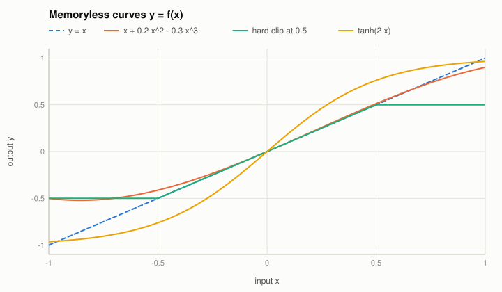
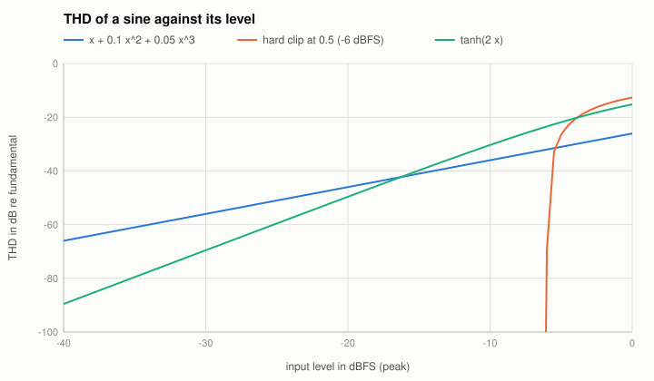

# Waveshapers: polynomial, hard and soft clipping

Code: `Waveshaper` and the harmonic formulas in `src/reference/Nonlinear.cpp`; in the Reference Nonlinear: "Curve", "Drive", "a2", "a3",
"Threshold", "Output".

A memoryless curve $y = f(x)$ turns a sine into a sum of its harmonics. Which harmonics and how strong is known exactly for the three curves here.

## Polynomial
$y = \sum_n c_n x^n$. With $x = A\cos\varphi$ and $\cos^n\varphi = 2^{-n}\sum_{j=0}^{n}\binom{n}{j}\cos\big((n - 2j)\varphi\big)$, each power $x^n$ gives the
harmonics $n, n-2, \dots$ (and a DC term for even $n$). For small coefficients:

$$\frac{H_2}{H_1} \approx \frac{c_2 A}{2},\qquad \frac{H_3}{H_1} \approx \frac{c_3 A^2}{4},\qquad \text{DC} = \frac{c_2 A^2}{2} .$$

Even powers give even harmonics (and DC), odd powers odd harmonics; harmonic $n$ needs at least the power $n$. The second harmonic grows by 6 dB, the third
by 12 dB per 6 dB of level. (Example: $x + 0.1x^2 + 0.05x^3 + 0.02x^5$ at $A = 0.5$: $H_2$ -32.13 dB, $H_3$ -49.17 dB, $H_5$ -82.23 dB re $H_1$, DC 0.0125.)

## Hard clipper
$y = \min(\max(x, -c), c)$. For a sine of amplitude $A > c$, with the clipping angle $a = \arcsin(c/A)$, only odd harmonics:

$$b_1 = \frac{4}{\pi}\Big(A\big(\tfrac{a}{2} - \tfrac{\sin 2a}{4}\big) + c\cos a\Big),\qquad
b_n = \frac{4}{\pi}\Big(\frac{A}{2}\Big(\frac{\sin((n-1)a)}{n - 1} - \frac{\sin((n+1)a)}{n + 1}\Big) + \frac{c\cos(na)}{n}\Big),\ n \text{ odd} \ge 3 .$$

Below the threshold nothing happens; above it the harmonics fall only with about $1/n^2$, so they reach far beyond Nyquist and **alias** in a sampled
system. (Found by the tests: with $f_s/f_0 = 612/13$ the harmonics near 600 folded back onto the 7th by 0.004 dB.)

## Soft clipper
$y = \tanh(g x)$: odd symmetry, so odd harmonics only; small-signal gain $g$; no closed form for the harmonics, they are computed by numerical
integration over one period (`getShaperHarmonics`).

## The known answer
Tests: closed forms = numerical integration (1e-12 polynomial, 1e-9 hard clip); a processed sine matches within 0.001 dB (harmonics above -80 dB);
the oracle: the prototype's THD measurement of the polynomial equals the closed form (THD -32.0344 dB).
