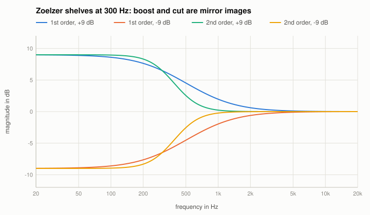

# The Zoelzer filters (DAFX)

U. Zoelzer (ed.), DAFX - Digital Audio Effects, 2nd ed., Wiley 2011, chapter 2 (tables 2.2-2.4). Code: `designZoelzer` in `src/reference/Designs.cpp`;
in the Reference EQ: algorithm "Zoelzer (DAFX)", types low shelf and high shelf (order 1 or 2) and peak.

With $K = \tan(\pi f_c / f_s)$ and $V = 10^{|G|/20}$:
- **1st-order shelves** as an all-pass decomposition: $H(z) = 1 + \frac{V - 1}{2}\,\big(1 \pm A(z)\big)$ with $A(z) = \dfrac{z^{-1} + c}{1 + c z^{-1}}$,
  $+$ for the low shelf, $-$ for the high shelf; boost $c = \frac{K - 1}{K + 1}$; the cut uses another $c$ so that it is the exact inverse of the boost.
  Analog prototypes (boost): low $\frac{s + V}{s + 1}$, high $\frac{V s + 1}{s + 1}$.
- **2nd-order shelves** ($Q = 1/\sqrt2$): low $\dfrac{s^2 + \sqrt{2V}\,s + V}{s^2 + \sqrt2\,s + 1}$, high $\dfrac{V s^2 + \sqrt{2V}\,s + 1}{s^2 + \sqrt2\,s + 1}$.
- **Peak**: $\dfrac{s^2 + (V/Q)\,s + 1}{s^2 + s/Q + 1}$.
- **Cut** = $1 / $ boost (with the same corner): in dB the cut is the mirror image of the boost.

Note the difference to RBJ: Zoelzer's shelves have their corner where the shelf starts (the gain at $f_c$ is not half the gain in dB as in RBJ), and
the boost and the cut peak have different bandwidths in the RBJ sense (RBJ's peak is symmetric in $A$, Zoelzer's in boost and cut).

## The known answer
Bilinear transform of the prototypes with pre-warping at $f_c$: the tests find the digital response equal to the prototype at the warped frequency
(9e-11 dB), and cut = -boost in dB within 1e-9 dB.

